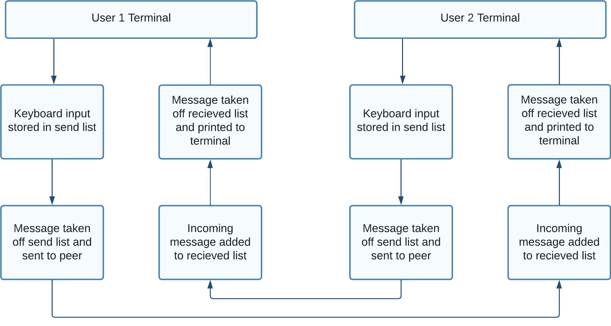

# Multithreaded Network Chat in C

Welcome to the Multithreaded Network Chat project! This application is an efficient chat app built using C, featuring multithreading and UDP sockets for responsive networking. The primary goal of this project is to demonstrate concepts in network programming within a multithreaded environment, showcasing a seamless peer-to-peer chat experience.

## Features

- **Multithreaded Architecture:** The application employs kernel level p-threads to handle concurrent tasks efficiently. Each thread is dedicated to specific responsibilities, such as keyboard input handling, UDP message exchange, and real-time message display.

- **Efficient Networking with UDP:** UDP is utilized to ensure efficient and low-latency communication between peers which is ideal suitable for real-time applications.

- **Threaded Keyboard Input Handling:** The application manages keyboard input using threads, allowing users to interact with the chat system while receiving messages. This design ensures that message processing does not interupt other aspects of the application.

- **Real-time Message Display:** Messages are displayed in real-time, providing a realistic chat experience. The multithreaded design allows for simultaneous message sending and receiving, making the conversation flow smoothly.

## Why UDP?

In this project, UDP (User Datagram Protocol) was chosen over TCP (Transmission Control Protocol) for its specific advantages in the context of a real-time chat application. UDP is a connectionless and lightweight protocol that offers faster communication compared to TCP. While TCP ensures reliable and ordered delivery of data, UDP sacrifices these guarantees for speed and efficiency.

## Message Flow Management

The core of this chat application lies in its ability to seamlessly handle both incoming and outgoing messages through the utilization of two essential lists:

### Incoming Message List

The program maintains a dynamic list to track and process incoming messages from other users. Each message is decoded and added to this list, allowing the application to handle multiple simultaneous messages concurrently.

### Outgoing Message List

The program also utilizes a separate list to manage outgoing messages. When a user sends a message, it is added to this list, ready to be transmitted to the peer.

### Process Diagram



By employing this dual-list system, the program enables real-time communication while preserving the integrity of message flow. The multithreaded design ensures that incoming and outgoing messages are processed without disrupting the overall chat experience.

## Installation and Use

Follow these steps to set up and run the Multithreaded Network Chat in C:

1. Clone the repository to your local machine:

   ```bash
   git clone https://github.com/Daksh2060/multithreaded-chat-networking-c.git
   ```

2. Compile the source code using makefile (recommended in WSL):

   ```bash
   make
   ```

3. To run, open two terminals, in the first terminal run the following command:

   ```bash
   ./chat [user1_port_number] [user2_machine_name] [user2_port_number]
   ```

   For example, if testing by yourself:

   ```bash
   ./chat 6000 localhost 7000
   ```

4. In the second terminal, run the following command:

   ```bash
   ./chat_app [user2_port_number] [user1_machine_name] [user1_port_number]
   ```

   For example, if testing by yourself:

   ```cpp
   ./chat 7000 localhost 6000
   ```

5. You can now send messages between the two terminals:

   ```bash
   Hello
   ```

   ```bash
   Received > Hello
   Hi
   ```

6. To terminate the chat, one user must send a "!", and both users will exit:
   ```bash
   !
   < Chat Has Been Ended >
   ```

## Contact

Feel free to reach out if you have any questions, suggestions, or feedback:

- **Email:** dpa45@sfu.ca
- **LinkedIn:** [@Daksh Patel](https://www.linkedin.com/in/daksh-patel-956622290/)
